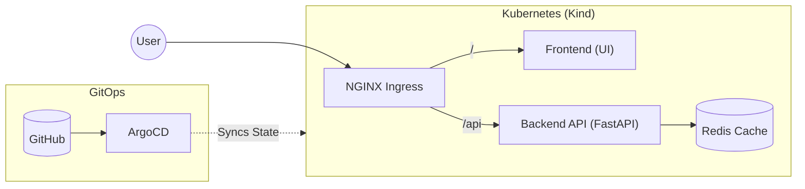

# GitOps Kubernetes demo

A minimal, hands-on microservice stack deployed on a local Kind cluster and continuously delivered with ArgoCD and Helm.

## Architecture Overview

Traffic flow
* **Frontend (`/`)**: Static UI served by NGINX showing real-time connectivity badges.
* **API (`/api`)**: FastAPI backend that logs requests and tracks visit counters.
* **Cache**: Redis instance storing visit state via internal DNS (`redis-service:6379`).
* **Delivery**: ArgoCD monitors the Helm chart in this repo. Any commit pushed to `main` automatically reconciles the cluster without manual `kubectl apply` commands.

## What's inside
* **Cluster**: Kind (1 control plane, 2 worker nodes)
* **Delivery**: ArgoCD
* **Ingress**: Ingress-NGINX
* **App Services**: Python 3.11 (FastAPI), Redis 7 (Alpine), HTML/JS on NGINX

